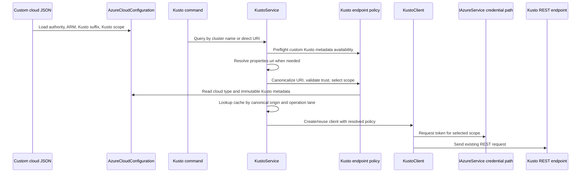

# feat: Add custom cloud support for Kusto queries

## Overview

Extend configuration-driven custom-cloud support to Azure Data Explorer (Kusto) data-plane queries. A custom-cloud deployment will declare a trusted Kusto DNS suffix and an explicit OAuth scope; Kusto commands will continue discovering cluster URIs through Azure Resource Graph or accepting `--cluster-uri`, but every resulting URI will be validated before Kusto-scope token acquisition, Kusto client caching, or Kusto data-plane HTTP. Subscription discovery may first perform the management-plane authentication and Resource Graph request required to obtain the URI.

The implementation will preserve the existing direct REST client, `IAzureService` credential and HTTP paths, transport independence, Native AOT compatibility, and built-in Azure public, US Government, and China behavior.

## Problem Frame

Custom-cloud metadata currently configures identity, ARM, Resource Graph, Log Analytics, and Application Insights endpoints, but Kusto queries still rely on hard-coded Azure Kusto DNS suffixes and hostname-derived token scopes. As a result, a cluster URI returned by Resource Graph or supplied directly is rejected when it belongs to a configured custom cloud, and the client has no safe way to select that cloud's Kusto OAuth audience.

Kusto differs from Log Analytics because the query endpoint is cluster-specific rather than one cloud-wide service endpoint. The configuration therefore needs to describe the trusted cluster namespace, not synthesize or replace individual cluster URIs.

## Requirements Trace

- **R1. Custom endpoint trust:** A custom cloud can configure one trusted Kusto DNS suffix that authorizes cluster URIs beneath that suffix.
- **R2. Custom authentication:** Queries to an authorized custom Kusto cluster request exactly the configured Kusto OAuth scope.
- **R3. Both cluster-selection paths:** Subscription/cluster discovery and direct `--cluster-uri` queries converge on the same endpoint validation and scope-selection behavior.
- **R4. Fail closed:** Partial or malformed metadata fails during configuration loading; absent metadata blocks Kusto data-plane invocation; and a cluster hostname outside the configured suffix fails before Kusto-scope token acquisition, cache insertion, or data-plane HTTP.
- **R5. Compatibility:** Existing public, US Government, and China Kusto endpoint and scope behavior remains unchanged.
- **R6. Isolation:** When `CloudType` is `CustomCloud`, the configured suffix replaces the built-in Kusto trust set; built-in endpoints are not implicitly trusted.
- **R7. Optional adoption:** Existing custom-cloud configurations that do not use the Kusto data plane remain valid, and Resource Graph-only cluster inventory remains available.
- **R8. Cross-layer confidence:** Deterministic coverage proves that public Azure endpoints can be declared through the custom-cloud configuration and used through the Kusto service/client query path; existing recordings continue to prove protocol compatibility.
- **R9. Repository completeness:** Configuration reference material, command documentation, e2e prompts, and changelog metadata describe the new support and its security constraints.

## Scope Boundaries

- Query-lane and Kusto control-command-lane traffic already sharing `KustoClient` should receive the same endpoint trust and authentication behavior; no new Kusto command is added.
- Resource Graph-only cluster list/get commands do not require Kusto suffix/scope metadata and remain available under a custom cloud.
- Cluster URI discovery remains based on the complete `properties.uri` value returned by Resource Graph. The implementation will not construct cluster hosts from names, regions, or suffixes.
- The configured value is a complete OAuth scope ending in `/.default`, consistent with `logAnalyticsScope`; the server will not discover or infer an audience from `/v1/rest/auth/metadata`.
- Custom-cloud mode trusts only the configured Kusto suffix. Cross-cloud Kusto queries from a custom-cloud server are not supported in this change.
- Only administrator-controlled server configuration can define the trusted suffix and scope. Callers cannot add trusted hosts through command options.
- Private Link continues using the cluster's normal application-facing hostname and controlled DNS. The plan does not add IP-address allowlisting or DNS-resolution policy.
- The work does not migrate the toolset to `Microsoft.Azure.Kusto.Data`, add ingestion support, change KQL validation, or alter query result shapes.
- General-purpose DNS-rebinding hardening for shared `HttpClient` infrastructure is outside this feature. Kusto data-plane requests will use a transport configuration that treats every redirect as terminal so an effective destination cannot bypass endpoint validation.
- Broad Kusto response-body, command-log, and activity-tag sanitization is pre-existing security-hardening work and will be tracked separately. This feature must not introduce new logging of suffixes, scopes, tokens, or raw rejected URI components.
- Initial support assumes the target custom cloud exposes its Kusto data-plane hosts beneath one dedicated descendant DNS namespace and accepts one OAuth audience. Estates requiring multiple suffixes, exact-host exceptions, or endpoint-specific audiences are outside the first release and require an additive configuration design.

## Context & Research

### Relevant Code and Patterns

- `core/Microsoft.Mcp.Core/src/Services/Azure/Authentication/CustomCloudMetadata.cs` defines configuration-backed custom service metadata.
- `core/Microsoft.Mcp.Core/src/Services/Azure/Authentication/AzureCloudConfiguration.cs` validates custom metadata, exposes built-in cloud values, and keeps custom authority configuration centralized.
- `core/Microsoft.Mcp.Core/src/Services/Azure/Authentication/IAzureCloudConfiguration.cs` is the boundary available through `IAzureService.CloudConfiguration`.
- `core/Azure.Mcp.Core/tests/Azure.Mcp.Core.Tests/Services/Azure/Authentication/AzureCloudConfigurationTests.cs` covers custom metadata loading and validation.
- `tools/Azure.Mcp.Tools.Kusto/src/Services/KustoService.cs` resolves `Microsoft.Kusto/clusters` through Resource Graph, consumes `properties.uri`, validates KQL, and caches clients.
- `tools/Azure.Mcp.Tools.Kusto/src/Services/KustoClient.cs` performs URI validation, selects Kusto token scopes, and sends direct REST requests through `IAzureService`.
- `tools/Azure.Mcp.Tools.Kusto/tests/Azure.Mcp.Tools.Kusto.Tests/KustoClientTests.cs` is the focused endpoint-security test surface.
- `tools/Azure.Mcp.Tools.Kusto/tests/Azure.Mcp.Tools.Kusto.Tests/KustoCommandTests.cs` provides recorded coverage for subscription-based and direct-URI operations.
- `tools/Azure.Mcp.Tools.Monitor/src/Services/MonitorService.cs` and `tools/Azure.Mcp.Tools.Monitor/tests/Azure.Mcp.Tools.Monitor.Tests/Services/MonitorServiceCustomCloudTests.cs` demonstrate explicit custom endpoint/scope usage and deterministic token/request assertions.
- `docs/recorded-tests.md` governs test-proxy recordings and sanitization.

### Institutional Learnings

The repository has no `docs/solutions/` knowledge base for this area. Existing custom-cloud implementation and tests establish the useful conventions:

- Store service endpoints/audiences/scopes explicitly rather than deriving custom-cloud identity metadata from DNS.
- Use the configured authority through the existing credential chain instead of adding a service-specific token endpoint.
- Keep resource discovery and data-plane endpoint trust separate: a URI returned by Resource Graph remains input that must pass Kusto validation.
- Preserve `IAzureService.GetClient()` so recorded tests, proxy behavior, and transport-independent authentication continue to work.

### External References

- [Kusto REST request model](https://learn.microsoft.com/en-us/kusto/api/rest/request?view=azure-data-explorer) documents cluster-relative query and management paths.
- [Kusto REST authentication](https://learn.microsoft.com/en-us/kusto/api/rest/authentication?view=azure-data-explorer) and [MSAL authentication](https://learn.microsoft.com/en-us/kusto/api/rest/authenticate-with-msal?view=azure-data-explorer) document Kusto resource/scope behavior.
- [Azure Kusto cluster REST resource](https://learn.microsoft.com/en-us/rest/api/azurerekusto/clusters/get?view=rest-azurerekusto-2025-02-14) exposes the complete query endpoint as `properties.uri`.
- [Kusto client network restrictions](https://learn.microsoft.com/en-us/kusto/api/get-started/app-client-network-restrictions?view=azure-data-explorer) recommends explicit trusted hosts or suffixes rather than disabling validation.
- [OWASP SSRF Prevention Cheat Sheet](https://cheatsheetseries.owasp.org/cheatsheets/Server_Side_Request_Forgery_Prevention_Cheat_Sheet.html) supports strict allowlisting for known outbound service destinations.

## Key Technical Decisions

| Decision | Rationale |
|---|---|
| Add `kustoEndpointSuffix` and `kustoScope` to custom-cloud metadata | Kusto endpoints are cluster-specific, so a trusted namespace plus explicit audience is more appropriate than a single service endpoint. |
| Treat `kustoScope` as the complete `/.default` scope | This matches `logAnalyticsScope`, avoids hidden transformation rules, and makes the exact token audience reviewable in configuration and tests. |
| Keep both fields optional when loading a custom cloud | Existing custom-cloud users who only need ARM, Resource Graph, cluster inventory, or Log Analytics must not be broken. |
| If either Kusto field is supplied, validate the pair at configuration load; if neither is supplied, fail only when Kusto is invoked | This catches malformed partial adoption early while preserving optional adoption. |
| In custom-cloud mode, replace the built-in Kusto suffix allowlist | It prevents accidental cross-cloud token requests and makes the configured trust boundary authoritative. |
| Keep built-in cloud suffix and scope behavior unchanged | This limits blast radius and avoids turning the feature into a broader Kusto authentication refactor. |
| Require a normalized DNS suffix rather than a URI or wildcard | Label-boundary matching is reviewable and prevents substring-based trust bypasses. |
| Continue using the cluster URI returned by Resource Graph | Microsoft exposes the complete endpoint; constructing endpoints would reintroduce cloud-specific assumptions. |
| Do not consume Kusto auth metadata dynamically | An endpoint-provided audience is untrusted network input and could induce token acquisition for another resource. Explicit configuration is safer for a custom cloud. |
| Resolve one canonical endpoint policy before credential lookup and client caching | Trust, scope selection, request construction, and cache identity must not disagree about equivalent or malformed URI representations. |
| Put endpoint classification and scope selection in the shared Kusto service/client path | Direct URI, discovered cluster, query, schema, sample, and management requests then receive one consistent security policy without duplicating validation rules. |
| Disable automatic redirects for Kusto data-plane requests | Validating only the initial URI is insufficient for a token-bearing SSRF boundary; every effective destination must be trusted. |
| Keep cached clients free of request-scoped credentials | Remote HTTP/OBO requests from different users can share tenant and endpoint values; cached state must not retain or replay another request's credential or token. |

### Configuration Contract

- `kustoEndpointSuffix` is normalized by the configuration layer to lower-case ASCII with a leading dot, for example `.kusto.contoso.example`. A safely normalizable missing leading dot or case difference is accepted; structurally ambiguous forms are rejected.
- It cannot include a scheme, wildcard, port, path, query, fragment, user information, whitespace, trailing dot, IP literal, unresolved Unicode host form, encoded delimiter, or single-label top-level value.
- A cluster hostname must contain at least one DNS label before the suffix; the suffix root alone is not a valid cluster endpoint.
- Matching occurs on DNS-label boundaries after URI host canonicalization.
- A cluster URI may have no path or the root path `/`; both normalize to the same origin. Non-root paths are rejected.
- Explicit ports, including `:443`, are rejected for cluster URIs and scopes so cache, audience, and request identity have one representation.
- `kustoScope` is one canonical absolute HTTPS scope URI ending in `/.default`, with no explicit port, user information, query, fragment, dot segment, encoded path delimiter, unresolved Unicode host form, or whitespace. It is passed unchanged as the sole token scope.
- A custom-cloud configuration containing only one of the two properties is invalid.
- Both properties omitted or explicitly `null` mean Kusto was not configured. Empty or whitespace values are malformed attempted configuration.
- A custom-cloud configuration containing neither property remains valid, but a Kusto operation produces an actionable missing-configuration error before discovery, cache access, or credential acquisition.
- The suffix and scope form one administrator-approved credential-delivery grant: any accepted descendant host can receive a token for exactly that configured audience. The operator is responsible for their semantic correspondence; the server does not infer, repair, or fall back to another audience.

## Open Questions

### Resolved During Planning

- **Trust model:** Use one configured DNS suffix plus one explicit OAuth scope.
- **Built-in endpoints under custom mode:** The custom suffix replaces built-in Kusto trust.
- **Scope representation:** Store the complete `/.default` scope.
- **Audience discovery:** Do not query `/v1/rest/auth/metadata`.
- **Adoption compatibility:** Kusto metadata is optional for the overall custom cloud but required for Kusto operations.
- **Public-cloud validation:** Add a deterministic cross-layer scenario that declares public endpoints and `.kusto.windows.net` through the custom-cloud configuration.
- **Inventory behavior:** Cluster list/get remain management-plane-only and available without Kusto suffix/scope metadata.
- **Initial topology:** The first release supports one dedicated descendant suffix and one audience; broader endpoint-grant collections are deferred until a concrete target requires them.

### Deferred to Implementation

- **Exact exception type and message composition:** Reuse the nearest repository-standard configuration/trust exception once the existing command error mapping is inspected; new validation messages must name the missing property or rejected canonical hostname without exposing suffix/scope values or raw URI components.
- **Recorded-test compatibility:** Preserve the existing Kusto recordings because the REST request and response shapes are unchanged; avoid adding a recording that cannot be reproduced without live test resources.
- **Follow-up hardening:** Review existing Kusto response-body reflection and command logging in a separate security-focused change rather than expanding this feature.

## High-Level Technical Design

> *This illustrates the intended approach and is directional guidance for review, not implementation specification. The implementing agent should treat it as context, not code to reproduce.*

The data-plane client decision matrix is:

| Active cloud | Accepted Kusto hosts | Scope source |
|---|---|---|
| Any built-in cloud | Existing combined built-in host trust set | Existing host-derived scope mapping |
| Custom with complete Kusto metadata | Only hosts beneath `kustoEndpointSuffix` | Configured `kustoScope` |
| Custom without complete Kusto metadata | None | Reject before token acquisition |

Under `CustomCloud`, membership in the static built-in allowlist grants no trust. A hostname that resembles a built-in endpoint is accepted only if it independently matches the configured custom suffix, and it always receives the configured custom scope.

Resource Graph-only cluster list/get operations do not enter this matrix because they do not contact the Kusto data plane.

## Implementation Units

- [x] **Unit 1: Extend and validate custom-cloud Kusto metadata**

**Goal:** Add an AOT-safe configuration contract for the trusted Kusto suffix and OAuth scope without breaking custom clouds that do not use Kusto.

**Requirements:** R1, R2, R4, R7

**Dependencies:** None

**Files:**
- Modify: `core/Microsoft.Mcp.Core/src/Services/Azure/Authentication/CustomCloudMetadata.cs`
- Modify: `core/Microsoft.Mcp.Core/src/Services/Azure/Authentication/IAzureCloudConfiguration.cs`
- Modify: `core/Microsoft.Mcp.Core/src/Services/Azure/Authentication/AzureCloudConfiguration.cs`
- Verify/modify if required: `core/Microsoft.Mcp.Core/src/Services/Azure/Authentication/CustomCloudMetadataJsonContext.cs`
- Test: `core/Azure.Mcp.Core/tests/Azure.Mcp.Core.Tests/Services/Azure/Authentication/AzureCloudConfigurationTests.cs`

**Approach:**
- Add nullable Kusto suffix and scope metadata exposed through `IAzureCloudConfiguration`.
- Keep both absent values valid for custom clouds that do not invoke Kusto.
- Validate supplied values as a complete pair and enforce the configuration contract above.
- Normalize the suffix once in the configuration layer so consumers do not implement competing normalization rules.
- Preserve source-generated JSON metadata and avoid reflection-based binding or validation.
- Keep built-in cloud behavior stable; Kusto-specific built-in mappings remain owned by the Kusto client unless implementation reveals a clean no-risk centralization.

**Execution note:** Add configuration characterization tests before changing validation behavior.

**Patterns to follow:**
- Existing Log Analytics metadata and validation in `AzureCloudConfiguration`.
- Existing custom-cloud tests in `AzureCloudConfigurationTests`.

**Test scenarios:**
- **Happy path:** Load a custom JSON file containing valid Kusto suffix and complete scope; expose normalized values through `IAzureCloudConfiguration`.
- **Compatibility:** Load an existing custom JSON file with neither Kusto property; custom-cloud construction succeeds and other metadata is unchanged.
- **Error path:** Supply only `kustoEndpointSuffix`; configuration fails and identifies `kustoScope`.
- **Error path:** Supply only `kustoScope`; configuration fails and identifies `kustoEndpointSuffix`.
- **Edge cases:** Reject suffix values containing a scheme, wildcard, path, port, whitespace, trailing dot, IP literal, or an overly broad/single-label suffix.
- **Edge cases:** Normalize permitted case and a missing leading dot into the documented lower-case, leading-dot representation; reject forms that cannot be normalized without ambiguity.
- **Error path:** Reject scopes that are non-HTTPS, omit `/.default`, or contain user information, query, fragment, or whitespace.
- **Regression:** Built-in cloud configuration remains constructible and its existing authority/ARM/Log Analytics values remain unchanged.

**Verification:**
- Valid custom Kusto metadata is available through the existing cloud-configuration boundary.
- Invalid partial or malformed metadata fails deterministically without network access.
- Custom clouds without Kusto metadata continue to support unrelated services.

- [x] **Unit 2: Apply custom endpoint trust and scope selection in `KustoClient`**

**Goal:** Route all Kusto data-plane requests through cloud-aware endpoint classification that safely supports the configured custom suffix.

**Requirements:** R1, R2, R3, R4, R5, R6

**Dependencies:** Unit 1

**Files:**
- Modify: `tools/Azure.Mcp.Tools.Kusto/src/Services/KustoClient.cs`
- Modify: `tools/Azure.Mcp.Tools.Kusto/src/Services/KustoService.cs`
- Modify: `tools/Azure.Mcp.Tools.Kusto/src/KustoSetup.cs`
- Modify: `core/Microsoft.Mcp.Core/src/Services/Http/HttpClientFactoryConfigurator.cs`
- Test: `tools/Azure.Mcp.Tools.Kusto/tests/Azure.Mcp.Tools.Kusto.Tests/KustoClientTests.cs`
- Create: `tools/Azure.Mcp.Tools.Kusto/tests/Azure.Mcp.Tools.Kusto.Tests/KustoServiceTests.cs`
- Create: `tools/Azure.Mcp.Tools.Kusto/tests/Azure.Mcp.Tools.Kusto.Tests/KustoHttpClientRegistrationTests.cs`

**Approach:**
- Resolve one Kusto-owned endpoint decision containing the canonical HTTPS origin and selected scope. Keep one enforceable construction boundary: either the client remains the sole resolver and exposes a pre-cache resolution operation, or it requires an immutable resolved value and raw URI construction is constrained. Do not preserve parallel raw and resolved paths.
- For direct `--cluster-uri`, complete policy resolution before tenant resolution, credential lookup, cache access, or HTTP.
- For subscription-based data-plane operations, preflight custom Kusto metadata availability before management-plane work; then permit Resource Graph discovery and resolve the returned URI before any Kusto-scope token request, Kusto client cache insertion, or data-plane HTTP.
- For built-in clouds, retain the current trusted suffixes, exact hosts, and scope mappings.
- For `CustomCloud`, require complete Kusto metadata and accept only canonical HTTPS cluster origins whose hosts have at least one label before the configured suffix.
- Select the configured scope only after the endpoint has matched the configured custom suffix.
- Ignore static built-in trust while custom mode is active. A public-shaped host is accepted only when it matches the configured custom suffix, and then uses the configured custom scope.
- Ensure direct `--cluster-uri` and Resource Graph `properties.uri` values converge on this same validation.
- Use the canonical origin for suffix matching, request construction, and both existing query/control-command cache lanes. Retain lane separation and tenant identity; equivalent accepted URI spellings must not create policy-divergent clients.
- Register an additive named Kusto HTTP client whose primary handler disables automatic redirects while retaining shared proxy, recording-handler, timeout, user-agent, and network configuration. The unnamed/default client and unrelated tools keep their existing redirect behavior.
- Have the Kusto path request the named client through the existing `IAzureService`/`IHttpClientFactory` boundary; do not construct a standalone `HttpClient` or bypass test-proxy behavior.
- Treat all Kusto 3xx responses as terminal and ensure no second request follows a `Location` value.
- Preserve existing Kusto REST error behavior in this feature except that new validation paths must not add sensitive configuration or raw URI values to errors or logs.
- Preserve REST paths, headers, payloads, result parsing, timeouts, and tenant-aware credential acquisition.
- Rely on process-immutable singleton cloud configuration to keep policy stable. Cache keys must use canonical origin, tenant, and the existing operation lane; include additional policy identity only if implementation reveals a mutable boundary.
- Cached objects must not retain request-scoped `TokenCredential` instances or bearer tokens. Resolve request identity within the current invocation so two OBO users in the same tenant cannot share authentication state.

**Execution note:** Implement endpoint classification and scope-selection behavior test-first because it is a token-bearing SSRF boundary.

**Patterns to follow:**
- Existing `ValidateAndNormalizeClusterUri` and `GetKustoScope` behavior in `KustoClient`.
- Exact scope/request assertions in `MonitorServiceCustomCloudTests`.
- Existing trusted suffix boundary tests in `KustoClientTests`.

**Test scenarios:**
- **Happy path:** Under `CustomCloud`, a direct URI beneath the configured suffix is normalized, requests exactly the configured scope, and sends the existing query request to the expected REST URI.
- **Scope proof:** Configure `.kusto.windows.net` with a distinct valid custom HTTPS scope and assert that exact scope—not the existing public hostname-derived scope—is requested.
- **Happy path:** A URI discovered through the service path beneath the configured suffix receives identical validation and scope behavior.
- **Error path:** Under `CustomCloud` with no Kusto metadata, reject before discovery, credential-provider access, cache access, token requests, or HTTP.
- **Error path:** Reject a direct custom hostname outside the configured suffix before tenant resolution, credential access, cache access, or HTTP.
- **Discovery error path:** Null, empty, non-deserializable, or parseable off-suffix `properties.uri` values may require different exception paths but all produce zero Kusto-scope token requests, cache insertions, and data-plane requests.
- **Security edge case:** Reject substring lookalikes, the suffix root itself, userinfo, non-HTTPS schemes, IP literals, explicit/unexpected ports, paths, queries, fragments, trailing-dot hosts, backslashes, encoded authority/path delimiters, and unresolved Unicode host forms.
- **Security edge case:** Under custom mode, a built-in Kusto host outside the configured suffix is rejected; one matching the configured suffix receives only the configured custom scope.
- **Canonicalization:** Equivalent permitted case/trailing-slash representations reuse the same lane-specific cached client; rejected alternate representations never reach the cache.
- **Redirects:** For 301, 302, 303, 307, and 308 responses with same-origin, same-suffix, external, loopback, or link-local `Location` values, assert one outbound request and no request/body/header delivery to the redirect target.
- **Transport registration:** Resolve the named Kusto client through production DI with and without the recording-proxy resolver; it does not follow redirects, while the unnamed/default client remains behaviorally unchanged.
- **Service ordering:** Mock cache, credential, Resource Graph, and HTTP dependencies to prove direct invalid inputs cause zero cache/credential/network calls and discovered invalid inputs cause no Kusto cache/credential/data-plane calls after discovery.
- **OBO isolation:** Two same-tenant requests with distinct request-scoped credentials cannot reuse the first request's credential or token through either cache lane.
- **Inventory compatibility:** Cluster list/get continue to use Resource Graph successfully when custom Kusto data-plane metadata is absent.
- **Regression:** Under each built-in cloud, retain its accepted hosts and exact existing token scope.
- **Regression:** Presence of custom metadata does not activate custom behavior when the active cloud is built-in.
- **Failure path:** Token acquisition failures and Kusto REST failures continue through existing exception handling without logging or returning credentials.
- **Integration:** Query, database, schema, table, sample, and Kusto control-command operations that contact the data plane inherit the same trust policy without command-specific branching.

**Verification:**
- No custom Kusto request can acquire a token or send HTTP unless the cluster host matches the configured suffix.
- Every accepted custom request uses the configured scope.
- Direct inputs are validated before credential/cache work; discovered inputs are validated before any Kusto data-plane credential/cache work.
- Redirects cannot create an unvalidated effective destination, and unrelated clients retain their existing transport behavior.
- Existing built-in Kusto tests and behavior remain stable.

- [x] **Unit 3: Add cross-layer custom-cloud query coverage**

**Goal:** Prove configuration-to-service behavior where public Azure endpoints are deliberately supplied through the custom-cloud contract.

**Requirements:** R3, R4, R5, R7, R8

**Dependencies:** Units 1 and 2

**Files:**
- Create: `tools/Azure.Mcp.Tools.Kusto/tests/Azure.Mcp.Tools.Kusto.Tests/KustoCustomCloudIntegrationTests.cs`
- Preserve: `tools/Azure.Mcp.Tools.Kusto/tests/Azure.Mcp.Tools.Kusto.Tests/KustoCommandTests.cs`
- Preserve: `tools/Azure.Mcp.Tools.Kusto/tests/Azure.Mcp.Tools.Kusto.Tests/assets.json`

**Approach:**
- Add a cross-layer scenario that loads actual custom-cloud JSON rather than substituting `IAzureCloudConfiguration`.
- Configure public identity/ARM endpoints, `.kusto.windows.net`, and the public Kusto scope while the active cloud is `custom`.
- Exercise the real configuration parser, Kusto service/client path, request-time credential acquisition, named HTTP client selection, request construction, and result parsing with deterministic HTTP and credential test doubles.
- Keep existing recorded tests unchanged because REST paths, payload shapes, and response parsing are unchanged.
- Treat the public-as-custom test as configuration-path wiring evidence; the Unit 2 distinct-scope test proves that hostname fallback is not selecting the scope.

**Patterns to follow:**
- Public-endpoints-as-custom configuration coverage in the Core custom-cloud tests.
- Existing Kusto REST response fixtures and result assertions.

**Test scenarios:**
- **Integration happy path:** Active cloud `custom` plus public endpoints, `.kusto.windows.net`, and public Kusto scope executes the service query path and returns the expected rows.
- **Integration error path:** Custom configuration lacking Kusto metadata produces the expected command error before a Kusto request appears in the recording.
- **Integration security path:** A direct URI outside the configured suffix is rejected without a data-plane request.
- **Recorded-test compatibility:** The existing Kusto playback suite remains green without recording changes.

**Verification:**
- The real custom-cloud configuration parser feeds a successful Kusto service query.
- Direct URI behavior is covered deterministically at the service/client boundary; existing command recordings continue proving protocol compatibility.

- [x] **Unit 4: Document and release the custom-cloud Kusto contract**

**Goal:** Make the new configuration discoverable, reviewable, and complete for repository release requirements.

**Requirements:** R9

**Dependencies:** Units 1-3

**Files:**
- Modify: `docs/sovereign-clouds.md`
- Modify: `servers/Azure.Mcp.Server/README.md`
- Modify: `servers/Azure.Mcp.Server/docs/azmcp-commands.md`
- Modify: `servers/Azure.Mcp.Server/docs/e2eTestPrompts.md`
- Create: `servers/Azure.Mcp.Server/changelog-entries/clarked-kusto-custom-cloud.yml`

**Approach:**
- Add the two JSON properties to the custom-cloud schema and example.
- Explain that both are optional globally but jointly required for Kusto operations under `--cloud custom`.
- Document canonical suffix and scope formats, replacement of built-in trust in custom mode, Resource Graph discovery behavior, direct URI behavior, and actionable failure cases.
- Include an example using nonproduction placeholder domains and a separate test note showing how public endpoints can validate the custom path.
- Keep command names and options unchanged; update Kusto command guidance to state that custom-cloud queries use the configured trust boundary.
- Ensure the changelog entry follows `docs/changelog-entries.md` with a non-empty `changes` array and valid section.

**Patterns to follow:**
- Existing custom ARM/Resource Graph/Log Analytics configuration examples.
- Existing Kusto e2e prompts and command reference entries.
- `servers/Azure.Mcp.Server/changelog-entries/clarked-custom-cloud.yml`.

**Test scenarios:**
- **Test expectation: none —** documentation and changelog metadata carry no executable behavior; schema/spelling validation applies through repository checks.

**Verification:**
- An operator can configure custom-cloud Kusto support without inferring suffix or scope syntax.
- PR completeness surfaces reflect the modified Kusto tool.

## System-Wide Impact

- **Interaction graph:** Server startup options load custom JSON into `AzureCloudConfiguration`; `IAzureService` exposes it to `KustoService`/`KustoClient`; commands reach the same client through direct URI or Resource Graph discovery.
- **Error propagation:** Structural metadata errors fail during configuration loading when partial/malformed values are supplied. Completely absent Kusto metadata fails before discovery, credential-provider access, cache access, or HTTP. Direct URI trust fails before tenant/credential/cache work. Resource Graph discovery may use management-plane credentials and HTTP first, but discovered URI trust fails before Kusto-scope token acquisition, cache insertion, or data-plane HTTP. Existing downstream identity/REST error mapping remains unchanged; new validation errors expose only the corrective property or canonical rejected hostname.
- **State lifecycle risks:** Kusto clients are cached in separate query/control-command lanes. Both lanes key on canonical origin and tenant, but cached objects do not retain request-scoped credentials or bearer tokens. Cloud configuration is immutable for the singleton process lifetime; no runtime configuration reload is introduced.
- **API surface parity:** Query, sample, schema, table, and database operations using the shared Kusto client must inherit the same custom-cloud policy. No command should implement an independent suffix or scope branch.
- **Transport security:** The original canonical hostname remains the URI authority, HTTP host, and TLS SNI. Certificate validation remains enabled; code does not rewrite requests to resolved IP literals. Kusto data-plane redirects are not followed.
- **Integration coverage:** Unit tests separately observe management-plane discovery, Kusto-scope token requests, cache insertion, and data-plane HTTP. Recorded tests prove configuration, Resource Graph discovery, credentials, and Kusto REST integration.
- **Unchanged invariants:** Existing command names/options, KQL safety validation, response models, REST paths, built-in-cloud host/scope semantics, remote HTTP/OBO behavior, and source-generated serialization remain unchanged. The narrow Kusto no-redirect policy is an intentional transport hardening.

## Risks & Dependencies

| Risk | Mitigation |
|---|---|
| A permissive suffix becomes an SSRF bypass | Enforce canonical DNS-suffix grammar, label-boundary matching, a required cluster label, HTTPS-only canonical origins, and rejection before token acquisition. |
| A custom token is sent to a built-in or attacker-controlled host | In custom mode, replace built-in trust and select the custom scope only after a successful custom-suffix match. |
| The suffix and scope authorize an unintended credential-delivery relationship | Treat them as one administrator trust grant, pass the sole scope unchanged, perform no inference/fallback, and document that semantic correspondence is an operator responsibility. |
| Existing custom-cloud data-plane behavior changes | The user-selected replacement policy intentionally removes implicit built-in-host trust under `CustomCloud`; classify and document this migration, provide an actionable invocation error, and keep Resource Graph-only inventory available. |
| Empty values are mistaken for optional non-adoption | Only both omitted or explicit `null` values mean non-adoption; empty/whitespace values are malformed configuration. |
| Partial configuration fails late with an opaque identity error | Validate one-property-only and malformed combinations during configuration loading with actionable property names. |
| Resource Graph returns malformed or unexpected `properties.uri` | Require equivalent fail-closed outcomes: deserialization failures stop after discovery, while parseable values pass canonical origin and suffix validation before Kusto token/cache/data-plane work. |
| Recorded tests do not prove the requested OAuth scope | Capture exact scope in deterministic client tests; use recordings only for cross-layer and protocol confidence. |
| Public-endpoints-as-custom test accidentally uses the built-in branch | Assert active `CloudType` is `CustomCloud` and make built-in suffixes unavailable except through the configured custom suffix. |
| URI variants split trust, dispatch, and cache identity | Produce one canonical HTTPS origin before cache access and use it for matching, request construction, and cache keys. |
| Redirects bypass initial endpoint validation | Use a Kusto no-redirect transport and treat every 3xx response as terminal; verify no second request for all redirect status classes. |
| Cached clients reuse one OBO user's identity for another | Keep request-scoped credentials/tokens out of cached state and verify two-user same-tenant isolation. |
| DNS or Private Link resolves a trusted host to an unexpected address | Preserve hostname-based TLS validation and document that this feature does not verify DNS ownership, restrict resolved IPs, or prevent DNS rebinding; require controlled DNS, Private DNS linkage, trusted PKI, and network egress policy operationally. |
| Kusto-only redirect configuration changes unrelated clients | Implement an additive named client, test both named and default registrations, and prohibit changes to shared default redirect semantics. |
| China/Government endpoint documentation changes | Preserve current tested mappings in this feature and continue consuming complete cluster URIs rather than constructing hosts. |

## Documentation / Operational Notes

- Operators must supply the Kusto service audience expected by their custom cloud as a complete `/.default` scope.
- The suffix authorizes every descendant hostname and must identify a Kusto-dedicated namespace, not a public suffix, registrable parent, or broad organization-wide application domain. Wildcard and arbitrary per-request trust are intentionally unsupported.
- Private Link deployments should configure the normal cluster hostname suffix and ensure deployment DNS resolves it appropriately.
- Custom DNS integrity, Private DNS linkage, valid hostname certificates, and outbound network policy are deployment prerequisites; the feature does not prove suffix ownership or constrain resolved IP ranges.
- The public-endpoints-as-custom recorded test validates code paths, not the semantics of an arbitrary sovereign cloud. Real custom-cloud deployments remain responsible for supplying their authority, ARM, Resource Graph, Kusto suffix, and Kusto scope values.
- Operators must confirm that their environment satisfies the initial one-suffix/one-audience topology before enabling the feature. Multiple namespaces, exact gateways, or endpoint-specific audiences require a future additive endpoint-grant model.
- The replacement policy is a behavioral migration for any custom-cloud deployment that previously reached a built-in Kusto hostname through the static allowlist; release notes must call this out even though the JSON file remains loadable.
- Validation should include the focused Core and Kusto projects, recorded Kusto tests, repository spelling checks, and the required local build verification for C# project changes.

## Sources & References

- Related code: `core/Microsoft.Mcp.Core/src/Services/Azure/Authentication/AzureCloudConfiguration.cs`
- Related code: `tools/Azure.Mcp.Tools.Kusto/src/Services/KustoClient.cs`
- Related tests: `tools/Azure.Mcp.Tools.Kusto/tests/Azure.Mcp.Tools.Kusto.Tests/KustoClientTests.cs`
- Related tests: `tools/Azure.Mcp.Tools.Kusto/tests/Azure.Mcp.Tools.Kusto.Tests/KustoCommandTests.cs`
- Pattern reference: `tools/Azure.Mcp.Tools.Monitor/tests/Azure.Mcp.Tools.Monitor.Tests/Services/MonitorServiceCustomCloudTests.cs`
- Test guidance: `docs/recorded-tests.md`
- External: [Kusto REST API](https://learn.microsoft.com/en-us/kusto/api/rest/?view=azure-data-explorer)
- External: [Kusto trusted endpoints](https://learn.microsoft.com/en-us/kusto/api/get-started/app-client-network-restrictions?view=azure-data-explorer)
- External: [Azure Kusto cluster REST resource](https://learn.microsoft.com/en-us/rest/api/azurerekusto/clusters/get?view=rest-azurerekusto-2025-02-14)
- External: [OWASP SSRF Prevention](https://cheatsheetseries.owasp.org/cheatsheets/Server_Side_Request_Forgery_Prevention_Cheat_Sheet.html)
